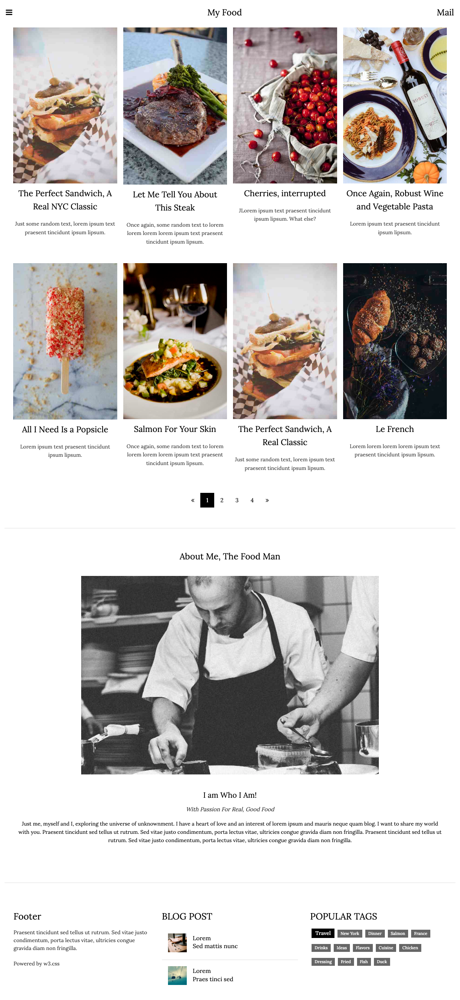
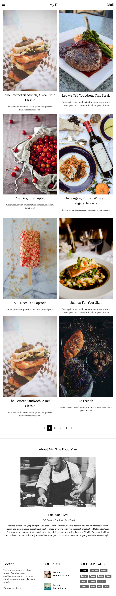
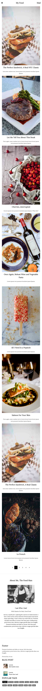
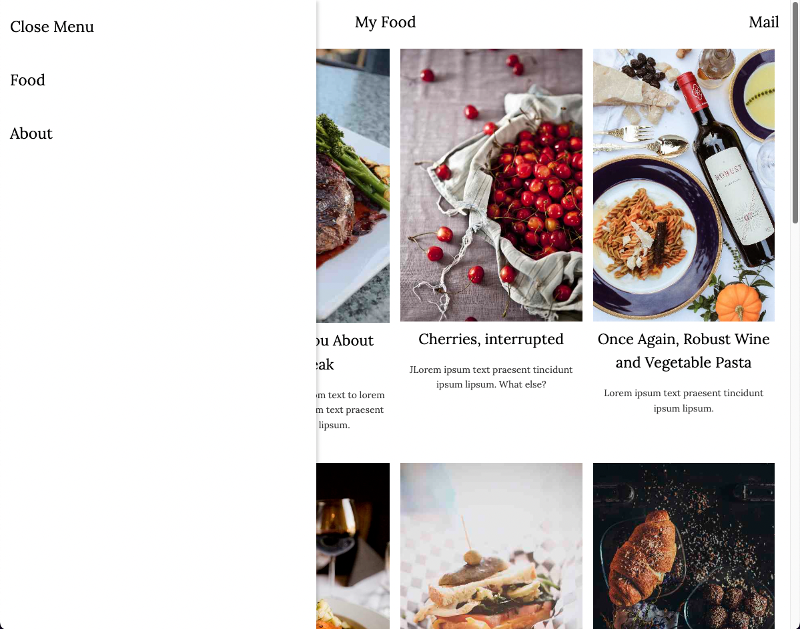

# 김관수 React - Clone Coding(3)
> 2022-10-29
## index.js
```javascript
import React from 'react';
import ReactDOM from 'react-dom/client';
import App from './App';
import Meta from './Meta';
import { BrowserRouter } from 'react-router-dom';
import GlobalStyles from './GlobalStyles';

const root = ReactDOM.createRoot(document.getElementById('root'));
root.render(
  <React.StrictMode>
    <Meta />
    <GlobalStyles />
    <BrowserRouter>
      <App />
    </BrowserRouter>
  </React.StrictMode>
);
```
## App.js
```javascript
import React from 'react';
import Header from './pages/Header';
import Main from './pages';
import Footer from './pages/Footer';

function App() {
  return (
    <div>
      <Header />
      <Main />
      <Footer />
    </div>
  );
}

export default App;
```
## GlobalStyles.js
```javascript
/**
 * @filename: GlobalStyles.js
 * @description: 전역으로 적용될 기본 스타일시트.
 *               이 파일에서 정의한 class는 ReactJSX에서 className속성으로 참조해야한다.
 * @author: KGS
 */

/** 패키지 참조 */
import { createGlobalStyle } from "styled-components";
// reset.css
import reset from 'styled-reset';

/**
 * 전역 스타일 시트를 정의한 객체
 * @type {GlobalStyleComponent<{}, DefaultTheme>}
 */
const GlobalStyles = createGlobalStyle`
    ${reset}

    * {}
    
    body {
        font-family: 'Lora', serif;
        margin: 0;
        padding: 0;
    }
`;

export default GlobalStyles;
```
## MediaQuery.js
```javascript
import breakpoints from 'styled-components-breakpoints';

/** 반응형 웹 구현 기준 사이즈 정의 */
const sizes = {
    sm: 600,
    md: 768,
    lg: 992,
    xl: 1200
};

/** 기준 사이즈를 활용하여 media query 생성 */
export default breakpoints(sizes);
```
## pages/Header.js
```javascript
import React, { memo, useCallback } from 'react';
import styled from 'styled-components';
import Nav from '../components/Nav';
import {HashLink} from 'react-router-hash-link';

const HeaderContainer = styled.div`
    font-family: 'Lora', serif;
    top: 0;
    box-sizing: border-box;
    position: fixed;
    display: flex;
    flex: 1;
    justify-content: space-between;
    background-color: #fff;
    width: 100%;
    z-index: 9999;
        div {
            text-align: center;
            font-size: 23px;
            line-height: 50px;
        }

        & .bar {
            text-align: center;
            line-height: 50px;
            padding: 8px 16px;
            font-size: 20px;
            color: #000;
            
            &:hover {
                background-color: #bbb;
                cursor: pointer;
            }
        }
        & .food {
            padding: 8px 16px;
        }
        & .mail {
            padding: 8px 16px;
        }
`

const Header = memo(() => {
    const sideBar = useCallback(() => {
        document.querySelector('.nav').style.display = 'block';
    })
    return (
        <HeaderContainer>
            <HashLink className='bar' onClick={sideBar}><i className="fa fa-bars" aria-hidden="true"></i></HashLink>
            <Nav />
            <div className='food'>My Food</div>
            <div className='mail'>Mail</div>
        </HeaderContainer>
    );
});

export default Header;
```
## pages/Footer.js
```javascript
import React, {memo} from 'react';
import styled from 'styled-components';
import mq from '../MediaQuery';
import Workshop from '../assets/img/workshop.jpeg';
import Gondol from '../assets/img/gondol.jpeg';

const FooterContainer = styled.div`
    max-width: 1200px;
    display: flex;
    padding: 32px 8px;
    margin: auto;
    box-sizing: border-box;

    ${mq.maxWidth('sm')`
        flex-wrap: wrap;
    `}

    .footerArea {
        width: 33.33%;
        padding: 8px 16px;

        ${mq.maxWidth('sm')`
        width: 100%
        `}
        
        & h3 {
            font-size: 24px;
        }
        
        & p {
            margin-top: 20px;
            line-height: 1.5em;
            font-size: 14px;
            color: rgba(0, 0, 0, 0.835);
        }
        
        & .w3c {
            color: rgba(0, 0, 0, 0.835);
        }

        & ul {
            margin-top: 25px;
            & li {
                padding: 8px 16px;
                box-sizing: border-box;
                
                & img {
                    float: left;
                    width: 50px;
                }
                & .blogTitle {
                    line-height: 1.6em;
                    padding: 8px 16px;
                }
                & .blogContent {
                    padding: 8px 16px;
                }
            }
            & hr {
                border: solid 1px #eee;
                margin-top: 20px;
            }
        }
        & .tags {
        
            & span {
                display: inline-block;
                text-align: center;
                font-size: 11px;
                padding: 0 8px;
                margin: 0 4px 15px;
                background-color: #666;
                color: #fff;
                font-weight: 500;

                &:first-child {
                    background-color: #000;
                    font-size: 14px;
                    padding: 2px 10px;
                }
            }
            /* margin-right: 10px; */
        }
    }
`

const tag = ['Travel', 'New York', 'Dinner', 'Salmon', 'France', 'Drinks', 'Ideas', 'Flavors', 'Cuisine', 'Chicken', 'Dressing', 'Fried', 'Fish', 'Duck'];

const Footer = memo(() => {
    return (
        <FooterContainer>
            <div className='footerArea'>
                <h3>Footer</h3>
                <p>
                    Praesent tincidunt sed tellus ut rutrum. Sed vitae justo condimentum, porta lectus vitae, ultricies congue gravida diam non fringilla.
                </p>
                <p className='w3c'>
                    Powered by <a>w3.css</a>
                </p>
            </div>                
            <div className='footerArea'>
                <h3>BLOG POST</h3>
                <ul>
                    <li className='workshop'>
                        
                        <span className='blogTitle'>Lorem</span>
                        <br />
                        <span className='blogContent'>Sed mattis nunc</span>
                    </li>
                    <hr />
                    <li className='gondol'>
                        
                        <span className='blogTitle'>Lorem</span>
                        <br />
                        <span className='blogContent'>Praes tinci sed</span>
                    </li>
                </ul>
            </div>
            <div className='footerArea'>
                <h3>POPULAR TAGS</h3>
                <p className='tags'>
                    {tag.map((v, i) => {
                        return <span key={i}>{v}</span>;
                    })}
                </p>
            </div>
        </FooterContainer>
    );
});

export default Footer;
```
## pages/index.js
```javascript
import React from 'react';
import Section1 from '../components/Section1';
import Section2 from '../components/Section2';

const Main = () => {
    return (
        <div>
            <Section1 />
            <Section2 />
        </div>
    );
};

export default Main;
```
## components/Section1.js
```javascript
import React, {memo} from 'react';
import styled from 'styled-components';
import Sandwich from '../assets/img/sandwich.jpeg';
import Steak from '../assets/img/steak.jpeg';
import Cherries from '../assets/img/cherries.jpeg';
import Wine from '../assets/img/wine.jpeg';
import Popsicle from '../assets/img/popsicle.jpeg';
import Salmon from '../assets/img/salmon.jpeg';
import Croissant from '../assets/img/croissant.jpeg';
import mq from '../MediaQuery';

const Section1Container = styled.div`
                
    .section1 {
        max-width: 1200px;
        margin: auto;
        .section1Item,
        .section2Item {
            margin-top: 50px;
            padding: 15px;
            & ul {
                display: flex;
                
                ${mq.maxWidth('lg')`
                    flex-wrap: wrap;
                `}
                ${mq.maxWidth('sm')`
                    flex-wrap: wrap;
                `}
                & li {
                    width: 25%;
                    list-style: none;
                    /* border: 1px solid #000; */
                    padding: 8px;
                    box-sizing: border-box;
                    ${mq.maxWidth('lg')`
                        width: 50%
                    `}
                    ${mq.maxWidth('sm')`
                        width: 100%
                    `}
                    
                    & img { 
                        width: 100%;
                    }
                    & h3 {
                        font-size: 22px;
                        text-align: center;
                        font-weight: normal;
                        padding: 7px;
                        line-height: 1.6em;
                    }
                    & p {
                        margin-top: 10px;
                        line-height: 1.6em;
                        font-size: 14px;
                        text-align: center;
                        color: rgba(0, 0, 0, 0.793);
                    }
    
                }
            }
    
        }
        .section2Item {
            margin-top: 0;
        }
                

        .btn {
            text-align: center;
            padding: 32px 0;
            .numBtn {
                display: inline-block;
                & a {
                    text-decoration: none;
                    color: #000;
                    font-size: 15px;
                    padding: 12px 16px;
                    width: auto;
                    display: block;
                    float: left;
                    
                    &:hover {
                        background-color: #000;
                        color: #fff;
                        cursor: pointer;
                    }
                }
                & a:nth-child(2) {
                    background-color: #000;
                    color: #fff;
                }
            }
        }
        hr {
            border: solid 1px #eee;
            margin: 20px 0;
        }
    }
`;

const menuList1 = [
    {img: Sandwich, title: 'The Perfect Sandwich, A Real NYC Classic', content: 'Just some random text, lorem ipsum text praesent tincidunt ipsum lipsum.'},
    {img: Steak, title: 'Let Me Tell You About This Steak', content: 'Once again, some random text to lorem lorem lorem lorem ipsum text praesent tincidunt ipsum lipsum.'},
    {img: Cherries, title: 'Cherries, interrupted', content: 'JLorem ipsum text praesent tincidunt ipsum lipsum. What else?'},
    {img: Wine, title: 'Once Again, Robust Wine and Vegetable Pasta', content: 'Lorem ipsum text praesent tincidunt ipsum lipsum.'}
];

const menuList2 = [
    {img: Popsicle, title: 'All I Need Is a Popsicle', content: 'Lorem ipsum text praesent tincidunt ipsum lipsum.'},
    {img: Salmon, title: 'Salmon For Your Skin', content: 'Once again, some random text to lorem lorem lorem lorem ipsum text praesent tincidunt ipsum lipsum.'},
    {img: Sandwich, title: 'The Perfect Sandwich, A Real Classic', content: 'Just some random text, lorem ipsum text praesent tincidunt ipsum lipsum.'},
    {img: Croissant, title: 'Le French', content: 'Lorem lorem lorem lorem ipsum text praesent tincidunt ipsum lipsum.'},

];

const Section1 = memo(() => {
    
    return (
        <Section1Container>
            <div className='section1'>
                <div className='section1Item'>
                    <ul>
                        {menuList1.map(({img, title, content}, i) => {
                            return (
                                <li key={i}>
                                    
                                    <h3>{title}</h3>
                                    <p>{content}</p>
                                </li>
                            )
                        })}
                    </ul>
                </div>
                <div className='section2Item'>
                    <ul>
                        {menuList2.map(({img, title, content}, i) => {
                            return (
                                <li key={i}>
                                    
                                    <h3>{title}</h3>
                                    <p>{content}</p>
                                </li>
                            )
                        })}
                    </ul>
                </div>
                <div className='btn'>
                    <div className='numBtn'>
                        <a href='#'><i className="fa fa-angle-double-left" aria-hidden="true"></i></a>
                        <a>1</a>
                        <a>2</a>
                        <a>3</a>
                        <a>4</a>
                        <a><i className="fa fa-angle-double-right" aria-hidden="true"></i></a>
                    </div>
                </div>
            <hr />
            </div>
        </Section1Container>
    );
});

export default Section1;
```
## components/Section2.js
```javascript
import React, {memo} from 'react';
import styled from 'styled-components';
import chef from '../assets/img/chef.jpeg';

const Section2Container = styled.div`
    
    max-width: 1200px;
    font-family: 'Lora', serif;
    // border: 1px solid #000;
    margin: auto;
    padding: 32px 8px;
    
    h3 {
        padding: 10px;
        text-align: center;
        font-size: 23px;
        margin-bottom: 15px;
    }
    .imgWrap {
        img {
            display: block;
            margin: auto;
            width: 66%;
        }

    }
    .introWr {
        margin-top: 45px;
        text-align: center;
        & h4 {
            margin-bottom: 20px;
            & b {
                font-size: 20px;
            font-weight: 400;
            }
        }
        & h6 {
            font-style: italic;
            font-size: 15px;
            margin-bottom: 20px;
            color: rgba(0, 0, 0, 0.813);
        }

        & p {
            line-height: 1.6em;
            font-size: 14px;
            padding: 0 30px;
            margin-bottom: 100px;
            // border: 1px solid #000;

        }
        hr {
            border: solid 1px #eee;
            margin: 10px 0 5px;
        }
    }
`

const Section2 = memo(() => {
    return (
        <Section2Container>
            <h3>About Me, The Food Man</h3>
            <br />
            <div className='imgWrap'>
                
            </div>
            <div className="introWr">
                <h4>
                    <b>I am Who I Am!</b>
                </h4>
                <h6>
                    <i>With Passion For Real, Good Food</i>
                </h6>                    
                <p>
                    Just me, myself and I, exploring the universe of unknownment. I have a heart of love and an interest of lorem ipsum and mauris neque quam blog. I want to share my world with you. Praesent tincidunt sed tellus ut rutrum. Sed vitae justo condimentum, porta lectus vitae, ultricies congue gravida diam non fringilla. Praesent tincidunt sed tellus ut rutrum. Sed vitae justo condimentum, porta lectus vitae, ultricies congue gravida diam non fringilla.
                </p>
            <hr />
            </div>
        </Section2Container>
    );
});

export default Section2;
```
## components/Nav.js
```javascript
import React, { memo, useCallback } from 'react';
import styled from 'styled-components';
import { HashLink } from 'react-router-hash-link';
import { Routes, Route } from 'react-router-dom';
import Section1 from './Section1';
import Section2 from './Section2';

const NavContainer = styled.div`
    display: none;
    position: fixed;
    width: 40%;
    min-width: 300px;
    top: 0;
    left: 0;
    box-shadow: 0 5px 5px 3px rgba(0, 0, 0, .16);
    z-index: 999999;
    height: 100%;
    background-color: #fff;
    /* overflow: hidden; */
    a {
        display: block;
        text-decoration: none;
        text-align: left;
        padding: 15px;
        color: #000;
        font-size: 23px;
        &:hover {
            background-color: #ccc
        }
    }
`

const Nav = memo(() => {
    const sideNav = useCallback(() => {
        document.querySelector('.nav').style.display = 'none';
    })
    return (
        <NavContainer className='nav'>
            <HashLink to='#' onClick={sideNav}>Close Menu</HashLink>
            <HashLink to='/#section1'>Food</HashLink>        
            <HashLink to='/#section2'>About</HashLink>
        </NavContainer>
    );
});

export default Nav;
```
### Desktop


### Tablet


### Mobile


### Nav
